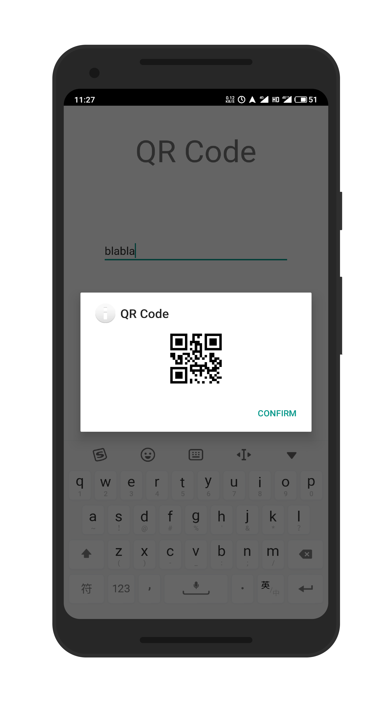
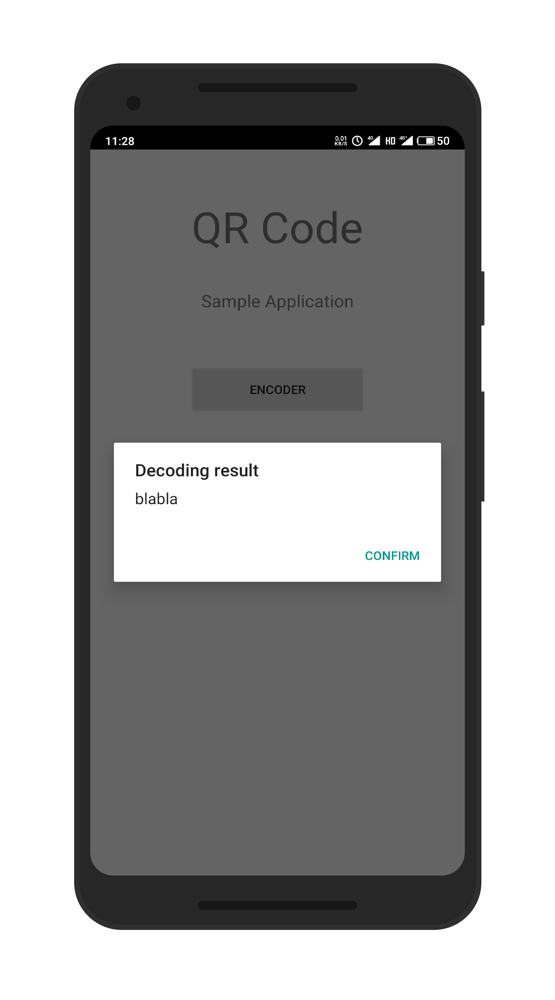

# Introduction

Nowadays, QR Code has a variety of applications including phone payment, class register, and information fetching, etc. And also it is not that difficult to develop an application with the capability of QR code encoding and decoding, thanks to the open-source multi-format 1D/2D barcode image processing library **Zxing**. Basic functionalities can be easily implemented in an Android phone using its modules for Android development.

This time, I will share my understanding on the code provided by *zhusy54*, and do some simple experiments  on my Android phone to verify performance of the application.

# Dependency

Main dependencies are:

- IDE: Android Studio 4.1 Canary 8 (a preview release version)
- [ZXing](https://github.com/zxing/zxing): the core module to implement QR code

Notice that I use a preview release version of Android studio just for convenience (which allows me to develop [Jetpack Compose](https://developer.android.com/jetpack/compose) applications in previous labs). We can use any version in theory.

# Troubleshooting

As others mentioned, opening an old project is always troublesome. The main reason lies on the fact that there are tons of conflictions between versions of SDK, building tool, and so on. **Gradle** is such a troublemaker here since the dependency within is so complicated. Higher version Gradle does not support Android SDKs of low versions, which may cause a series of problems.

To avoid trouble, I apply the simplest solution: do nothing. Keep my IDE silent and stepping away from my Gradle configuration files. In this way, the project can be built successfully in one shot, although the SDK and building tool version is quite old and might be deprecated.

# Basic Structure

Two main functions are implemented in the project:

- Encode a string into a QR Code
- Decode a QR Code into its original string

## Permissions Requesting

To enable the device's camera functionality, we need to first request related permissions, which are defined in *AndroidManifest.xml*.

```xml
<uses-permission android:name="android.permission.VIBRATE" />  
<uses-permission android:name="android.permission.CAMERA" />
<uses-feature android:name="android.hardware.camera" />        
<uses-feature android:name="android.hardware.camera.autofocus" /> 
```

When we invoke the camera function, the permission will be granted.

## MainActivity

As the entrance of the application, `MainActivity` implements the functions `onCreate()` and `onActivityResult()` to action when the application is initially created (not installed) and jumps from another activity, respectively.

### onCreate()

Here the author defines the layout to display as well as listeners to clicks on the buttons. In this manner, when we click `ENCODER` or `DECODER` button in the main screen, we will jump into the corresponding screen.

### onActivityResult()

To receive results of scanning when we finish the decode process, we need to implement `onActivity()` function. The author implements it to pop up an alert dialog with the decoding result if we scan the QR code successfully in the camera activity.

```java
if (resultCode == RESULT_OK) {
	Bundle bundle = data.getExtras();
	String scanResult = bundle.getString("result");
	new AlertDialog.Builder(MainActivity.this)
		.setTitle("Decoding result")
        .setMessage(scanResult)
        .setPositiveButton("Confirm", new DialogInterface.OnClickListener() {
			@Override
            public void onClick(DialogInterface dialog, int which) {
            	dialog.dismiss();
            }
		})
		.show();
}
```

## Encoder

If we click the button `ENCODER` on the main screen, we will be navigated to another activity to encode strings into QR code. 

When we input some string and click the `GENERATE` button, a QR code will be generated. This is implemented mainly by `MultiFormatWriter()`, an useful API provided by ZXing with supports on a variety of barcode formats. 

With `MultiFormatWriter()`, we can create a `BitMatrix` object to record black modules (square dots)
arranged in the square grid. It contains information like QR code version, format, data and error correction keys, required patterns, etc. We can use `get()`, `getWidth()` and `getHeight()` to unpack the information and then draw the image of QR code.

```java
BitMatrix matrix = new MultiFormatWriter().encode(
	contentString,
    BarcodeFormat.QR_CODE, 300, 300
);
int width = matrix.getWidth();
int height = matrix.getHeight();
int[] pixels = new int[width * height];

for (int y = 0; y < height; y++) {
    for (int x = 0; x < width; x++) {
    	if (matrix.get(x, y)) {
    		pixels[y * width + x] = Color.BLACK;
    	}
    }
}
```

Once we record pixel information in `pixels`, we can use `Bitmap` to label those bits and then create the QR code image with it. The generated QR code is presented with an alert dialog again.

```java
Bitmap bitmap = Bitmap.createBitmap(
    width, 
    height,
    Bitmap.Config.ARGB_8888
);
bitmap.setPixels(pixels, 0, width, 0, 0, width, height);
ImageView image1 = new ImageView(TestEncoder.this);
image1.setImageBitmap(bitmap);

new AlertDialog.Builder(TestEncoder.this)
    .setTitle("QR Code")
    .setIcon(android.R.drawable.ic_dialog_info)
    .setView(image1)
    .setPositiveButton("Confirm", new DialogInterface.OnClickListener(){
        @Override
        public void onClick(DialogInterface dialog, int which) {
            dialog.dismiss();
        }
    })
    .show();
```

## Decoder

The author use `SurfaceView` to dynamically display camera interface. We can deal with the surface and control the surface size and format, edit the pixels in the surface, and monitor changes to the surface with `SurfaceHolder`.

To receive information about changes to the surface and then react to them, three main functions of interface `SurfaceHolder.Callback` must be implemented:

- `surfaceCreated()` defines the actions to operate after the surface is first created.
- `surfaceChanged()` defines the actions to operate when any structural changes (format or size) have been made to the surface.
- `surfaceDestroyed()` defines the actions to operate before a surface is being destroyed.

`surfaceCreated` and `surfaceChanged()` mainly deal with camera launching, autofocus and shutting down. The author implements QR code decoding in `surfaceCreated()`.

### surfaceCreated()

When the surface is created, we need to fill it with the camera interface.  

First of all, we need to set the surface for our `Camera` object as the preview surface.

```java
mCamera = Camera.open();

try {
    mCamera.setPreviewDisplay(mSurfaceHolder);
} catch (Exception ex) {
    if(null != mCamera) {
        mCamera.release();
        mCamera = null;
    }
}
```

Then, we need to install a callback function for the `Camera` object to repeatedly read QR codes in the camera. We can receive raw data of what the camera captures with `PlanarYUVLuminanceSource` and then pack it in a `BinaryBitmap`. ZXing's `QRCodeReader` can then try to decode valid QR code information from it. If a QR code is decoded successfully, this activity will be shut down and return to `MainActivity`, which will then invoke `onActivityResult()` to deal with the result.

```java
mCamera.setPreviewCallback(new Camera.PreviewCallback(){
    @Override
    public void onPreviewFrame(byte[] data, Camera camera) {
        int previewWidth = camera.getParameters().getPreviewSize().width;
        int previewHeight = camera.getParameters().getPreviewSize().height;

        PlanarYUVLuminanceSource source = new PlanarYUVLuminanceSource(
            data, 
            previewWidth, 
            previewHeight, 
            0, 0, 
            previewWidth,
            previewHeight, 
            false
        );
        BinaryBitmap bitmap = new BinaryBitmap(new HybridBinarizer(source));

        Reader reader = new QRCodeReader();

        try {
            Result result = reader.decode(bitmap);
            String text = result.getText();

            Intent intent = new Intent();
            Bundle bundle = new Bundle();
            bundle.putString("result", result.toString());
            intent.putExtras(bundle);
            setResult(RESULT_OK, intent);
            finish();
        } catch (Exception e) {
            e.printStackTrace();
        }
    }
});
```

# Experiment

To test the functionality, I run this application on my Android 9.0 phone. Everything works as we desire.

First of all, I tried to encode a string into a QR code. 



Then I tried to decode it. Both the camera and decoder work fine.

